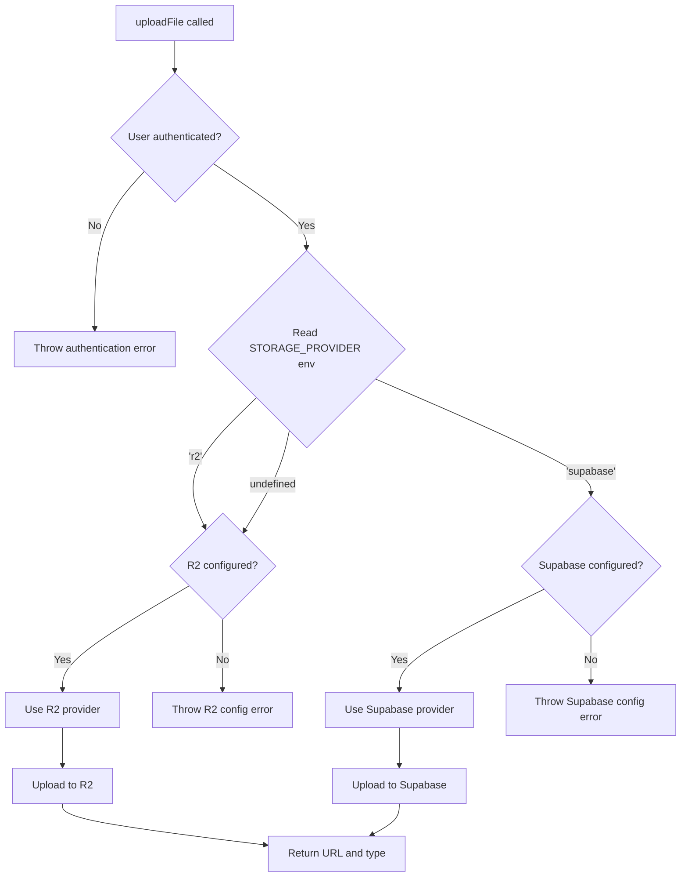

# Design Document

## Overview

Esta feature implementa suporte ao Cloudflare R2 como provedor de storage alternativo ao Supabase Storage. O design utiliza um padrão de Strategy para abstrair a implementação de storage, permitindo trocar entre provedores através de configuração sem modificar o código da aplicação.

## Architecture

### High-Level Architecture

```
┌─────────────────────────────────────────────────────────────┐
│                     Application Layer                        │
│  (Actions: image/create, video/create, upload components)   │
└────────────────────────┬────────────────────────────────────┘
                         │
                         │ uploadFile(file, bucket, filename?)
                         ▼
┌─────────────────────────────────────────────────────────────┐
│                  Storage Abstraction Layer                   │
│                    (lib/upload.ts)                           │
│  - Validates authentication                                  │
│  - Selects storage provider based on STORAGE_PROVIDER        │
│  - Delegates to appropriate provider implementation          │
└────────────┬────────────────────────────┬───────────────────┘
             │                            │
             │ R2                         │ Supabase
             ▼                            ▼
┌────────────────────────┐   ┌───────────────────────────────┐
│   R2 Storage Provider  │   │  Supabase Storage Provider    │
│   (lib/storage/r2.ts)  │   │  (lib/storage/supabase.ts)    │
│                        │   │                               │
│  - S3Client            │   │  - Supabase Client            │
│  - PutObjectCommand    │   │  - storage.upload()           │
│  - URL generation      │   │  - getPublicUrl()             │
└────────────────────────┘   └───────────────────────────────┘
```

### Storage Provider Selection Flow



## Components and Interfaces

### 1. Storage Provider Interface

Define o contrato que todos os provedores de storage devem implementar:

```typescript
// lib/storage/types.ts

export type StorageBucket = 'avatars' | 'files' | 'screenshots';

export interface UploadOptions {
  contentType: string;
  upsert?: boolean;
}

export interface UploadResult {
  url: string;
  type: string;
}

export interface StorageProvider {
  /**
   * Upload a file to storage
   * @param userId - User ID for organizing files
   * @param bucket - Logical bucket name
   * @param filename - Name of the file
   * @param file - File to upload
   * @param options - Upload options
   * @returns Upload result with public URL
   */
  upload(
    userId: string,
    bucket: StorageBucket,
    filename: string,
    file: File | Buffer | Uint8Array,
    options: UploadOptions
  ): Promise<UploadResult>;
}
```

### 2. R2 Storage Provider

Implementação do provedor R2 usando AWS SDK:

```typescript
// lib/storage/r2.ts

import { S3Client, PutObjectCommand } from '@aws-sdk/client-s3';
import type { StorageProvider, StorageBucket, UploadOptions, UploadResult } from './types';

class R2StorageProvider implements StorageProvider {
  private client: S3Client;
  private bucketName: string;
  private publicUrl?: string;

  constructor() {
    // Validate required environment variables
    if (!process.env.R2_ACCOUNT_ID) {
      throw new Error('R2_ACCOUNT_ID is not defined');
    }
    if (!process.env.R2_ACCESS_KEY_ID) {
      throw new Error('R2_ACCESS_KEY_ID is not defined');
    }
    if (!process.env.R2_SECRET_ACCESS_KEY) {
      throw new Error('R2_SECRET_ACCESS_KEY is not defined');
    }
    if (!process.env.R2_BUCKET_NAME) {
      throw new Error('R2_BUCKET_NAME is not defined');
    }

    this.bucketName = process.env.R2_BUCKET_NAME;
    this.publicUrl = process.env.R2_PUBLIC_URL;

    this.client = new S3Client({
      region: 'auto',
      endpoint: `https://${process.env.R2_ACCOUNT_ID}.r2.cloudflarestorage.com`,
      credentials: {
        accessKeyId: process.env.R2_ACCESS_KEY_ID,
        secretAccessKey: process.env.R2_SECRET_ACCESS_KEY,
      },
    });
  }

  async upload(
    userId: string,
    bucket: StorageBucket,
    filename: string,
    file: File | Buffer | Uint8Array,
    options: UploadOptions
  ): Promise<UploadResult> {
    // Build the key with bucket prefix and user organization
    const key = `${bucket}/${userId}/${filename}`;

    // Convert File to Buffer if needed
    let body: Buffer | Uint8Array;
    if (file instanceof File) {
      const arrayBuffer = await file.arrayBuffer();
      body = Buffer.from(arrayBuffer);
    } else {
      body = file;
    }

    // Upload to R2
    const command = new PutObjectCommand({
      Bucket: this.bucketName,
      Key: key,
      Body: body,
      ContentType: options.contentType,
    });

    await this.client.send(command);

    // Generate public URL
    const url = this.publicUrl
      ? `${this.publicUrl}/${key}`
      : `https://${this.bucketName}.r2.cloudflarestorage.com/${key}`;

    return {
      url,
      type: options.contentType,
    };
  }
}

export const r2Storage = new R2StorageProvider();
```

### 3. Supabase Storage Provider

Wrapper para o storage do Supabase mantendo a mesma interface:

```typescript
// lib/storage/supabase.ts

import { createClient } from '@/lib/supabase/client';
import type { StorageProvider, StorageBucket, UploadOptions, UploadResult } from './types';

class SupabaseStorageProvider implements StorageProvider {
  async upload(
    userId: string,
    bucket: StorageBucket,
    filename: string,
    file: File | Buffer | Uint8Array,
    options: UploadOptions
  ): Promise<UploadResult> {
    const client = createClient();

    // Convert Buffer/Uint8Array to File if needed
    let fileToUpload: File;
    if (file instanceof File) {
      fileToUpload = file;
    } else {
      fileToUpload = new File([file], filename, {
        type: options.contentType,
      });
    }

    // Upload to Supabase Storage
    const { data, error } = await client.storage
      .from(bucket)
      .upload(`${userId}/${filename}`, fileToUpload, {
        contentType: options.contentType,
        upsert: options.upsert,
      });

    if (error) {
      throw new Error(error.message);
    }

    // Get public URL
    const { data: urlData } = client.storage
      .from(bucket)
      .getPublicUrl(data.path);

    return {
      url: urlData.publicUrl,
      type: options.contentType,
    };
  }
}

export const supabaseStorage = new SupabaseStorageProvider();
```

### 4. Storage Factory

Seleciona o provedor apropriado baseado na configuração:

```typescript
// lib/storage/factory.ts

import type { StorageProvider } from './types';
import { r2Storage } from './r2';
import { supabaseStorage } from './supabase';

export type StorageProviderType = 'r2' | 'supabase';

export function getStorageProvider(): StorageProvider {
  const providerType = (process.env.STORAGE_PROVIDER || 'r2') as StorageProviderType;

  switch (providerType) {
    case 'r2':
      return r2Storage;
    case 'supabase':
      return supabaseStorage;
    default:
      throw new Error(`Unknown storage provider: ${providerType}`);
  }
}
```

### 5. Updated Upload Function

Refatoração da função uploadFile para usar o sistema de provedores:

```typescript
// lib/upload.ts

import { nanoid } from 'nanoid';
import { createClient } from './supabase/client';
import { getStorageProvider } from './storage/factory';
import type { StorageBucket } from './storage/types';

export const uploadFile = async (
  file: File,
  bucket: StorageBucket,
  filename?: string
) => {
  // Validate authentication
  const client = createClient();
  const { data } = await client.auth.getUser();

  if (!data?.user) {
    throw new Error('You need to be logged in to upload a file!');
  }

  // Generate filename if not provided
  const extension = file.name.split('.').pop();
  const name = filename ?? `${nanoid()}.${extension}`;

  // Get the configured storage provider
  const storage = getStorageProvider();

  // Upload using the selected provider
  const result = await storage.upload(
    data.user.id,
    bucket,
    name,
    file,
    {
      contentType: file.type,
      upsert: bucket === 'screenshots',
    }
  );

  return result;
};
```

## Data Models

### Environment Variables

Novas variáveis de ambiente necessárias:

```typescript
// lib/env.ts - additions

server: {
  // ... existing variables ...
  
  // Storage Provider Selection
  STORAGE_PROVIDER: z.enum(['r2', 'supabase']).optional().default('r2'),
  
  // Cloudflare R2 Configuration
  R2_ACCOUNT_ID: z.string().min(1).optional(),
  R2_ACCESS_KEY_ID: z.string().min(1).optional(),
  R2_SECRET_ACCESS_KEY: z.string().min(1).optional(),
  R2_BUCKET_NAME: z.string().min(1).optional(),
  R2_PUBLIC_URL: z.string().url().optional(),
}

runtimeEnv: {
  // ... existing variables ...
  
  STORAGE_PROVIDER: process.env.STORAGE_PROVIDER,
  R2_ACCOUNT_ID: process.env.R2_ACCOUNT_ID,
  R2_ACCESS_KEY_ID: process.env.R2_ACCESS_KEY_ID,
  R2_SECRET_ACCESS_KEY: process.env.R2_SECRET_ACCESS_KEY,
  R2_BUCKET_NAME: process.env.R2_BUCKET_NAME,
  R2_PUBLIC_URL: process.env.R2_PUBLIC_URL,
}
```

### .env.example Updates

```bash
# Storage Provider Configuration
# Options: 'r2' (default) or 'supabase'
STORAGE_PROVIDER=r2

# Cloudflare R2 Configuration (required if STORAGE_PROVIDER=r2)
R2_ACCOUNT_ID=your_account_id
R2_ACCESS_KEY_ID=your_access_key_id
R2_SECRET_ACCESS_KEY=your_secret_access_key
R2_BUCKET_NAME=your_bucket_name
# Optional: Custom domain for R2 public URLs
R2_PUBLIC_URL=https://cdn.yourdomain.com
```

## Error Handling

### Error Types

```typescript
// lib/storage/errors.ts

export class StorageError extends Error {
  constructor(message: string, public readonly provider: string) {
    super(message);
    this.name = 'StorageError';
  }
}

export class StorageConfigError extends StorageError {
  constructor(message: string, provider: string) {
    super(message, provider);
    this.name = 'StorageConfigError';
  }
}

export class StorageUploadError extends StorageError {
  constructor(message: string, provider: string, public readonly cause?: Error) {
    super(message, provider);
    this.name = 'StorageUploadError';
  }
}

export class StorageAuthError extends StorageError {
  constructor(message: string, provider: string) {
    super(message, provider);
    this.name = 'StorageAuthError';
  }
}
```

### Error Handling Strategy

1. **Configuration Errors**: Thrown at provider initialization
   - Missing environment variables
   - Invalid credentials format
   - Missing bucket configuration

2. **Upload Errors**: Thrown during upload operation
   - Network failures
   - Permission denied
   - Bucket not found
   - File size limits

3. **Authentication Errors**: Thrown before upload attempt
   - User not logged in
   - Invalid session

## Testing Strategy

### Unit Tests

1. **Storage Provider Tests**
   - Test R2 provider upload with valid credentials
   - Test Supabase provider upload with valid credentials
   - Test error handling for invalid credentials
   - Test URL generation with and without custom domain

2. **Factory Tests**
   - Test provider selection based on STORAGE_PROVIDER
   - Test default to R2 when STORAGE_PROVIDER is undefined
   - Test error for unknown provider type

3. **Upload Function Tests**
   - Test authentication check
   - Test filename generation
   - Test provider delegation
   - Test error propagation

### Integration Tests

1. **End-to-End Upload Flow**
   - Upload file with R2 provider
   - Upload file with Supabase provider
   - Verify file accessibility via public URL
   - Test upsert behavior for screenshots bucket

2. **Provider Switching**
   - Change STORAGE_PROVIDER and verify correct provider is used
   - Verify no code changes needed in application layer

### Manual Testing Checklist

- [ ] Configure R2 credentials and upload a file
- [ ] Verify file is accessible via public URL
- [ ] Switch to Supabase and upload a file
- [ ] Verify file is accessible via Supabase URL
- [ ] Test with missing credentials (should fail gracefully)
- [ ] Test with invalid credentials (should fail with clear error)
- [ ] Upload large file (>10MB) to R2
- [ ] Test upsert behavior with screenshots bucket

## Migration Strategy

### Phase 1: Add R2 Support (Non-Breaking)

1. Add new storage provider files
2. Update env.ts with new variables
3. Keep existing uploadFile working with Supabase by default
4. Add STORAGE_PROVIDER=supabase to maintain current behavior

### Phase 2: Switch to R2

1. Configure R2 credentials in environment
2. Set STORAGE_PROVIDER=r2
3. Restart application
4. Verify uploads work correctly

### Phase 3: Cleanup (Optional)

1. If fully migrated to R2, can remove Supabase storage dependencies
2. Keep abstraction layer for future flexibility

## Performance Considerations

1. **Provider Initialization**: Providers are initialized once as singletons
2. **File Conversion**: Minimal overhead when converting between File/Buffer/Uint8Array
3. **URL Generation**: R2 URLs are generated synchronously (no API call needed)
4. **Parallel Uploads**: Multiple files can be uploaded concurrently

## Security Considerations

### Authentication & Authorization

1. **User Authentication**: User authentication checked before any upload operation
2. **Server-Side Only**: All storage operations happen server-side (Server Actions, API Routes)
3. **Credentials**: All credentials stored in environment variables (never exposed to client)

### Access Control Strategy

**Public Bucket with Unpredictable URLs**

This implementation uses public buckets with unpredictable filenames for simplicity and performance.

**Pros:**
- Simple implementation
- Fast access (no auth checks on read)
- Works well with CDN caching
- Good for user-generated content that's meant to be shared

**Security Features:**
- Files organized by userId: `{bucket}/{userId}/{nanoid}.ext`
- Unpredictable filenames using nanoid (21 characters, ~2.8 million years to brute force at 1M attempts/sec)
- Content type validation on upload
- User authentication required for upload
- File size limits enforced

**Best for:** Images, videos, and files that users intend to share or display publicly (which matches this application's use case)

### R2 Bucket Configuration

**Setup Steps:**

1. Create bucket in Cloudflare dashboard
2. Enable "Public Access" in bucket settings
3. Configure custom domain (optional but recommended for better URLs)
4. Note the bucket name and account ID

**Custom Domain Setup (Optional):**
- Connect a custom domain to your R2 bucket
- Set `R2_PUBLIC_URL=https://cdn.yourdomain.com` in environment
- Benefits: Branded URLs, better caching, easier to migrate later

### Content Security

1. **Content Type Validation**: Always validate and set content type explicitly
2. **File Size Limits**: Implement max file size checks before upload
3. **Malware Scanning**: Consider integrating with scanning service for user uploads
4. **Rate Limiting**: Implement rate limits on upload endpoints

```typescript
// lib/upload.ts - additions

const MAX_FILE_SIZE = 100 * 1024 * 1024; // 100MB

export const uploadFile = async (
  file: File,
  bucket: StorageBucket,
  filename?: string,
  accessLevel: AccessLevel = 'public'
) => {
  // ... authentication ...
  
  // File size validation
  if (file.size > MAX_FILE_SIZE) {
    throw new Error(`File size exceeds maximum allowed size of ${MAX_FILE_SIZE / 1024 / 1024}MB`);
  }
  
  // Content type validation
  const allowedTypes = {
    avatars: ['image/jpeg', 'image/png', 'image/webp'],
    files: ['image/jpeg', 'image/png', 'image/webp', 'video/mp4', 'audio/mpeg'],
    screenshots: ['image/jpeg', 'image/png', 'image/webp'],
  };
  
  if (!allowedTypes[bucket].includes(file.type)) {
    throw new Error(`File type ${file.type} not allowed for bucket ${bucket}`);
  }
  
  // ... rest of upload ...
};
```


## Scalability

1. **R2 Advantages**:
   - No file size limits (unlike Supabase's 10MB limit)
   - Lower costs for large files
   - Better performance for high-volume uploads
   - Global CDN distribution

2. **Provider Abstraction**: Easy to add more providers (S3, GCS, Azure) in the future

## Dependencies

### New Dependencies

```json
{
  "@aws-sdk/client-s3": "^3.x.x"
}
```

### Existing Dependencies

- `@supabase/ssr` (already installed)
- `nanoid` (already installed)

## Rollback Plan

If issues occur with R2:

1. Set `STORAGE_PROVIDER=supabase` in environment
2. Restart application
3. System reverts to Supabase Storage
4. No code changes needed
