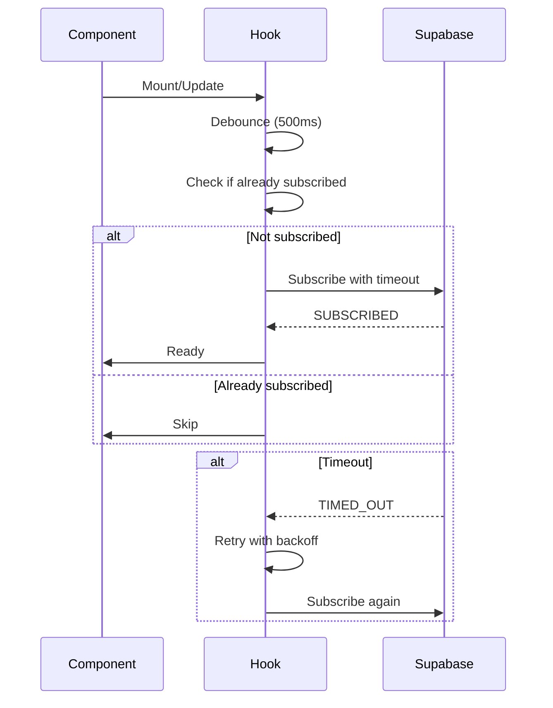

# Design Document

## Overview

Os erros de TIMED_OUT no Realtime estão ocorrendo porque múltiplas tentativas de subscrição estão sendo feitas simultaneamente, causando timeouts. Os logs do servidor mostram que as mensagens estão sendo entregues com sucesso, então o problema está no lado do cliente.

## Root Cause Analysis

Analisando os hooks `use-queue-monitor.ts` e `use-project-realtime.ts`, identificamos:

1. **Múltiplas tentativas de subscrição**: O código está tentando se conectar várias vezes ao mesmo canal
2. **Race conditions**: O flag `isSubscribingRef` não está prevenindo todas as tentativas simultâneas
3. **Falta de debouncing**: Mudanças rápidas de estado podem causar múltiplas subscrições
4. **Timeout padrão muito curto**: O Supabase pode estar usando um timeout muito agressivo

## Architecture

### Current Flow (Problematic)
```
Component Mount → useEffect → Check State → Subscribe → TIMED_OUT
                                    ↓
                            (Multiple attempts)
```

### Proposed Flow (Fixed)
```
Component Mount → useEffect → Debounce → Check State → Subscribe → Success
                                              ↓
                                    (Single attempt with retry)
```

## Components and Interfaces

### 1. Enhanced Subscription Management

**File**: `hooks/use-queue-monitor.ts` e `hooks/use-project-realtime.ts`

**Changes**:
- Adicionar debouncing para prevenir múltiplas subscrições
- Melhorar verificação de estado do canal
- Aumentar timeout de subscrição
- Adicionar retry logic com backoff exponencial

### 2. Supabase Client Configuration

**File**: `lib/supabase/client.ts`

**Changes**:
- Configurar timeout de subscrição mais longo
- Ajustar parâmetros de reconnection
- Habilitar logging detalhado em desenvolvimento

## Data Models

Não há mudanças nos modelos de dados.

## Error Handling

### Timeout Handling
```typescript
// Aumentar timeout de subscrição
const SUBSCRIPTION_TIMEOUT = 30000; // 30 segundos

// Retry logic com backoff exponencial
const MAX_RETRIES = 3;
const RETRY_DELAY = [1000, 2000, 4000]; // ms
```

### State Management
```typescript
// Melhor gerenciamento de estado
const subscriptionState = {
  isSubscribing: false,
  isSubscribed: false,
  retryCount: 0,
  lastAttempt: null
};
```

## Testing Strategy

### Unit Tests
- Testar debouncing de subscrições
- Testar retry logic
- Testar cleanup de canais

### Integration Tests
- Testar múltiplas subscrições simultâneas
- Testar reconexão após timeout
- Testar comportamento com rede lenta

### Manual Testing
1. Abrir múltiplas abas do navegador
2. Verificar que não há erros de TIMED_OUT
3. Verificar que mensagens são recebidas corretamente
4. Testar reconexão após perda de rede

## Implementation Notes

### Priority 1: Fix Immediate Timeouts
- Adicionar debouncing de 500ms
- Melhorar verificação de estado do canal
- Prevenir múltiplas tentativas simultâneas

### Priority 2: Improve Reliability
- Configurar timeout mais longo no cliente Supabase
- Adicionar retry logic
- Melhorar logging

### Priority 3: Optimize Performance
- Implementar connection pooling
- Adicionar métricas de performance
- Otimizar cleanup de canais

## Configuration Changes

### Supabase Client
```typescript
const supabase = createClient(url, key, {
  realtime: {
    params: {
      log_level: 'info',
      eventsPerSecond: 10
    },
    timeout: 30000, // 30 segundos
    heartbeatIntervalMs: 30000
  }
});
```

### Hook Configuration
```typescript
const DEBOUNCE_DELAY = 500; // ms
const SUBSCRIPTION_TIMEOUT = 30000; // ms
const MAX_RETRIES = 3;
```

## Diagrams

### Subscription Flow


## Migration Strategy

1. **Phase 1**: Aplicar fixes nos hooks existentes
2. **Phase 2**: Atualizar configuração do cliente Supabase
3. **Phase 3**: Adicionar testes e monitoramento
4. **Phase 4**: Deploy e validação

## Rollback Plan

Se os fixes causarem problemas:
1. Reverter mudanças nos hooks
2. Manter configuração antiga do cliente
3. Investigar logs para identificar causa raiz
4. Aplicar fix alternativo

## Success Metrics

- Zero erros de TIMED_OUT no console
- Tempo de subscrição < 5 segundos
- Taxa de sucesso de subscrição > 99%
- Mensagens recebidas em < 1 segundo
