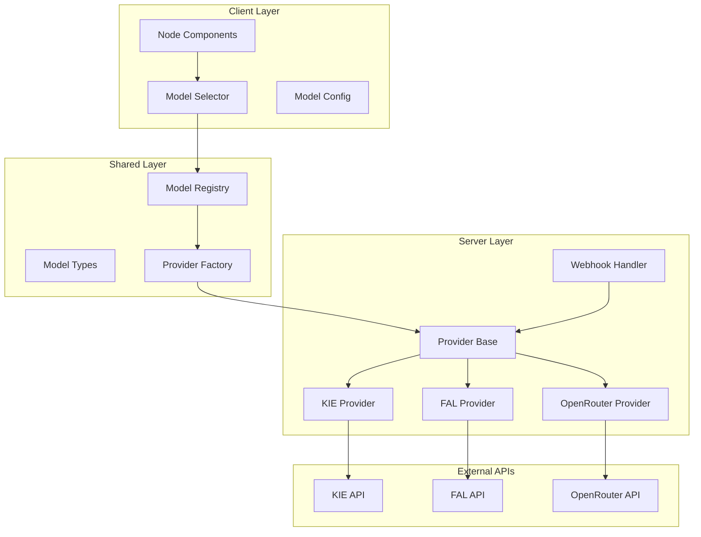

# Design Document

## Overview

This design document outlines the refactoring of the model provider architecture in the Tersa application. The current system has inconsistent implementations across different model types (image, video, text, audio) and providers (KIE, FAL, OpenRouter). The refactoring will create a unified, maintainable, and extensible architecture using proven patterns from the KIE and OpenRouter implementations.

The refactoring addresses several key issues:
- Inconsistent provider interfaces across model types
- Duplicated logic for request/response handling
- Mixed client/server code boundaries
- Inconsistent error handling and state management
- Difficult model configuration and maintenance

## Architecture

### Core Components



### Unified Provider Architecture

The new architecture implements a three-layer approach:

1. **Client Layer**: UI components and model selection logic
2. **Shared Layer**: Type definitions and factory patterns
3. **Server Layer**: Provider implementations and API integrations

## Components and Interfaces

### 1. Model Registry

The Model Registry serves as the central configuration system for all models and providers.

```typescript
// lib/models/registry.ts
export interface ModelDefinition {
  id: string;
  label: string;
  provider: ProviderType;
  type: ModelType;
  capabilities: ModelCapabilities;
  pricing: PricingConfig;
  parameters: ModelParameters;
  enabled: boolean;
  default?: boolean;
}

export interface ModelCapabilities {
  inputTypes: NodeType[];
  outputType: NodeType;
  supportsWebhook: boolean;
  supportsPolling: boolean;
  maxInputs?: number;
}

export interface PricingConfig {
  type: 'fixed' | 'variable' | 'token-based';
  cost: number | PricingTiers;
  unit: 'request' | 'second' | 'token';
}

export class ModelRegistry {
  private static models: Map<string, ModelDefinition> = new Map();
  
  static register(definition: ModelDefinition): void;
  static getModel(id: string): ModelDefinition | undefined;
  static getModelsByType(type: ModelType): ModelDefinition[];
  static getModelsByProvider(provider: ProviderType): ModelDefinition[];
  static getEnabledModels(type?: ModelType): ModelDefinition[];
}
```

### 2. Provider Factory

The Provider Factory implements the factory pattern for creating provider instances with consistent configuration.

```typescript
// lib/models/provider-factory.ts
export interface ProviderConfig {
  apiKey: string;
  baseUrl?: string;
  webhookUrl?: string;
  timeout?: number;
  retryConfig?: RetryConfig;
}

export class ProviderFactory {
  private static instances: Map<string, ProviderBase> = new Map();
  
  static createProvider<T extends ProviderBase>(
    type: ProviderType,
    config: ProviderConfig
  ): T;
  
  static getProvider<T extends ProviderBase>(type: ProviderType): T;
  static clearCache(): void;
}
```

### 3. Provider Base Class

The Provider Base Class defines the common interface and shared logic for all providers.

```typescript
// lib/models/provider-base.ts
export abstract class ProviderBase<TInput, TOutput> {
  protected config: ProviderConfig;
  protected abstract providerName: string;
  
  constructor(config: ProviderConfig);
  
  // Abstract methods that each provider must implement
  protected abstract submitToExternalAPI(input: TInput): Promise<JobSubmissionResult>;
  protected abstract normalizeResponse(response: unknown): TOutput;
  protected abstract validateInput(input: TInput): void;
  
  // Common methods with shared implementation
  async generate(input: TInput): Promise<GenerationResult<TOutput>>;
  protected async createJob(input: TInput): Promise<string>;
  protected async updateProjectState(metadata: JobMetadata, state: NodeState): Promise<void>;
  protected normalizeError(error: unknown): StandardError;
}
```

### 4. Webhook Handler

The Webhook Handler provides unified processing for all provider webhooks.

```typescript
// lib/webhooks/unified-handler.ts
export class UnifiedWebhookHandler {
  static async processWebhook(
    provider: ProviderType,
    payload: unknown
  ): Promise<WebhookProcessingResult>;
  
  private static normalizePayload(
    provider: ProviderType,
    payload: unknown
  ): NormalizedWebhookPayload;
  
  private static updateJobStatus(
    jobId: string,
    status: JobStatus,
    result?: unknown,
    error?: string
  ): Promise<void>;
}
```

## Data Models

### Unified Type System

```typescript
// lib/models/types.ts
export type ModelType = 'image' | 'video' | 'text' | 'audio';
export type ProviderType = 'kie' | 'fal' | 'openrouter' | 'gateway';
export type NodeType = 'text' | 'image' | 'video' | 'audio' | 'file' | 'tweet';

export interface GenerationInput {
  modelId: string;
  prompt?: string;
  images?: string[];
  parameters?: Record<string, unknown>;
  metadata: JobMetadata;
}

export interface GenerationResult<T> {
  state: NodeState;
  nodeData: {
    state: NodeState;
    updatedAt: string;
  };
  result?: T;
}

export type NodeState =
  | { status: 'idle' }
  | { status: 'generating'; requestId: string; jobId: string; modelId: string }
  | { status: 'loading'; url?: string }
  | { status: 'ready'; url: string; timestamp: string }
  | { status: 'error'; error: StandardError };

export interface StandardError {
  type: ErrorType;
  message: string;
  canRetry: boolean;
  statusCode?: number;
  silent?: boolean;
}

export type ErrorType = 
  | 'validation' 
  | 'api' 
  | 'network' 
  | 'timeout' 
  | 'node_deleted' 
  | 'project_deleted' 
  | 'webhook';
```

### Model Configuration Schema

```typescript
// lib/models/config.ts
export interface ModelConfig {
  image: {
    [modelId: string]: {
      provider: 'kie' | 'fal';
      endpoint?: string;
      capabilities: {
        textToImage: boolean;
        imageToImage: boolean;
        supportedSizes: string[];
      };
      pricing: PricingConfig;
      parameters: {
        strength?: { min: number; max: number; default: number };
        steps?: { min: number; max: number; default: number };
      };
    };
  };
  video: {
    [modelId: string]: {
      provider: 'fal' | 'luma' | 'runway';
      endpoints: {
        textToVideo?: string;
        imageToVideo?: string;
      };
      capabilities: {
        durations: number[];
        aspectRatios: string[];
      };
      pricing: PricingConfig;
    };
  };
  text: {
    [modelId: string]: {
      provider: 'openrouter' | 'gateway';
      pricing: {
        input: string;
        output: string;
      };
    };
  };
}
```

## Error Handling

### Standardized Error System

The new architecture implements a comprehensive error handling system with consistent error types and retry logic.

```typescript
// lib/models/errors.ts
export class ModelError extends Error {
  constructor(
    public type: ErrorType,
    message: string,
    public canRetry: boolean = false,
    public statusCode?: number,
    public silent: boolean = false
  ) {
    super(message);
    this.name = 'ModelError';
  }
}

export class ErrorHandler {
  static handle(error: unknown, context: ErrorContext): ModelError;
  static shouldRetry(error: ModelError, attempt: number): boolean;
  static getRetryDelay(attempt: number): number;
}
```

### Retry Strategy

```typescript
// lib/models/retry.ts
export interface RetryConfig {
  maxAttempts: number;
  baseDelay: number;
  maxDelay: number;
  backoffMultiplier: number;
  retryableErrors: ErrorType[];
}

export class RetryManager {
  static async withRetry<T>(
    operation: () => Promise<T>,
    config: RetryConfig
  ): Promise<T>;
}
```

## Testing Strategy

### Unit Testing

Each component will have comprehensive unit tests covering:

1. **Model Registry Tests**
   - Model registration and retrieval
   - Filtering by type and provider
   - Configuration validation

2. **Provider Factory Tests**
   - Provider instantiation
   - Configuration handling
   - Caching behavior

3. **Provider Base Tests**
   - Input validation
   - Error normalization
   - State management

4. **Webhook Handler Tests**
   - Payload normalization
   - Job status updates
   - Error handling

### Integration Testing

Integration tests will verify:

1. **End-to-End Generation Flow**
   - Request submission to result processing
   - Webhook processing
   - State synchronization

2. **Provider Compatibility**
   - Each provider implementation
   - Error scenarios
   - Timeout handling

3. **Node Integration**
   - Model selection
   - Parameter validation
   - State updates

### Test Structure

```typescript
// lib/models/__tests__/
├── model-registry.test.ts
├── provider-factory.test.ts
├── provider-base.test.ts
├── webhook-handler.test.ts
├── error-handling.test.ts
└── integration/
    ├── image-generation.test.ts
    ├── video-generation.test.ts
    └── text-generation.test.ts
```

## Migration Strategy

### Phase 1: Foundation
1. Create unified type system
2. Implement Model Registry
3. Create Provider Base class
4. Set up testing infrastructure

### Phase 2: Provider Implementation
1. Refactor KIE provider to use new base
2. Refactor FAL provider to use new base
3. Refactor OpenRouter provider to use new base
4. Implement unified webhook handler

### Phase 3: Node Integration
1. Update image nodes to use new system
2. Update video nodes to use new system
3. Update text nodes to use new system
4. Update model selectors

### Phase 4: Configuration Migration
1. Migrate existing model configurations
2. Update environment variable handling
3. Implement feature flags for gradual rollout
4. Update documentation

### Backward Compatibility

During migration, the system will maintain backward compatibility by:
- Keeping existing interfaces until migration is complete
- Using feature flags to enable new system gradually
- Providing migration utilities for existing data
- Maintaining existing webhook endpoints during transition

## Performance Considerations

### Caching Strategy
- Provider instances cached in factory
- Model configurations cached in registry
- Webhook responses cached for deduplication

### Resource Management
- Connection pooling for HTTP clients
- Request queuing for rate limiting
- Memory management for large payloads

### Monitoring
- Request/response timing metrics
- Error rate tracking
- Provider availability monitoring
- Resource usage tracking

## Security Considerations

### API Key Management
- Server-side only API key storage
- Environment variable validation
- Key rotation support

### Input Validation
- Strict input sanitization
- Parameter validation
- File type verification

### Webhook Security
- Signature verification
- Request origin validation
- Rate limiting

## Deployment Strategy

### Feature Flags
```typescript
// lib/models/feature-flags.ts
export interface FeatureFlags {
  useUnifiedProviders: boolean;
  enableNewWebhookHandler: boolean;
  enableProviderCaching: boolean;
}
```

### Environment Configuration
```typescript
// lib/models/env-config.ts
export interface ProviderEnvironment {
  KIE_API_KEY?: string;
  FAL_API_KEY?: string;
  OPENROUTER_API_KEY?: string;
  WEBHOOK_BASE_URL?: string;
  PROVIDER_TIMEOUT?: number;
}
```

### Rollout Plan
1. Deploy with feature flags disabled
2. Enable for internal testing
3. Gradual rollout to user segments
4. Full deployment after validation
5. Remove old system after stabilization

This design provides a solid foundation for a unified, maintainable, and extensible model provider architecture that addresses all the requirements while maintaining backward compatibility during the migration process.