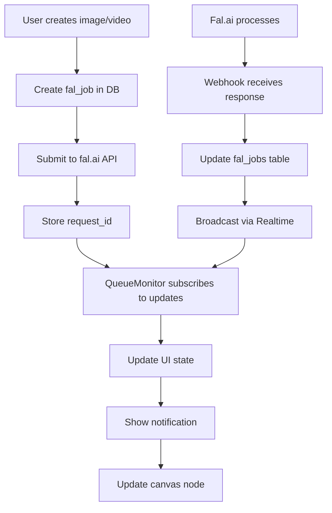
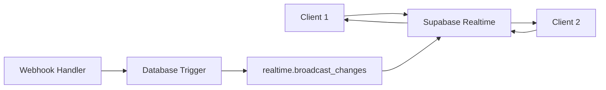

# Design Document

## Overview

O sistema de monitoramento de fila de requisições será implementado como um componente React que exibe um indicador visual no canto superior direito da interface, próximo ao menu existente. Quando clicado, abre um modal com detalhes completos de todas as requisições de geração de conteúdo (imagens e vídeos) do usuário.

O sistema utilizará Supabase Realtime com broadcast para sincronização em tempo real entre múltiplas janelas/abas e para receber notificações quando o webhook do fal.ai atualizar o status das requisições.

## Architecture

### Component Hierarchy

```
TopRight (existing)
├── CreditsDisplay (existing)
├── QueueMonitor (new)
│   ├── QueueIndicator
│   │   ├── QueueIcon
│   │   └── QueueBadge
│   └── QueueModal
│       ├── QueueHeader
│       ├── QueueFilters
│       ├── QueueList
│       │   └── QueueItem[]
│       │       ├── QueueItemStatus
│       │       ├── QueueItemInfo
│       │       ├── QueueItemThumbnail
│       │       └── QueueItemActions
│       └── QueueFooter
└── Menu (existing)
```

### Data Flow



### Realtime Architecture



## Components and Interfaces

### 1. QueueMonitor Component

**Location:** `components/queue-monitor.tsx`

**Purpose:** Container principal que gerencia estado global da fila e coordena sub-componentes.

**Props:**
```typescript
interface QueueMonitorProps {
  userId: string;
  projectId?: string; // Optional: filter by project
}
```

**State:**
```typescript
interface QueueState {
  jobs: FalJob[];
  isOpen: boolean;
  filter: 'all' | 'pending' | 'completed' | 'failed';
  sortBy: 'createdAt' | 'status';
  sortOrder: 'asc' | 'desc';
}
```

**Key Responsibilities:**
- Gerenciar estado da fila de jobs
- Coordenar abertura/fechamento do modal
- Integrar com Supabase Realtime para atualizações
- Fornecer contexto para componentes filhos

### 2. QueueIndicator Component

**Location:** `components/queue-monitor/queue-indicator.tsx`

**Purpose:** Ícone clicável no canto direito que mostra contador de requisições ativas.

**Props:**
```typescript
interface QueueIndicatorProps {
  activeCount: number;
  onClick: () => void;
}
```

**Visual States:**
- Default: Ícone de lista/fila sem badge
- Active (count > 0): Ícone com badge mostrando número
- Hover: Tooltip com resumo rápido

**Design:**
```typescript
// Ícone: List ou Clock icon do lucide-react
// Badge: Componente Badge do shadcn/ui
// Container: Similar ao Menu existente (rounded-full border bg-card/90)
```

### 3. QueueModal Component

**Location:** `components/queue-monitor/queue-modal.tsx`

**Purpose:** Modal que exibe lista completa de requisições com filtros e ações.

**Props:**
```typescript
interface QueueModalProps {
  isOpen: boolean;
  onClose: () => void;
  jobs: FalJob[];
  filter: QueueFilter;
  onFilterChange: (filter: QueueFilter) => void;
  onClearCompleted: () => void;
  onClearFailed: () => void;
}
```

**Layout:**
```
┌─────────────────────────────────────┐
│ Fila de Requisições          [X]    │
├─────────────────────────────────────┤
│ [Todas] [Pendentes] [Completadas]   │
│ [Erros]                             │
├─────────────────────────────────────┤
│ ┌─────────────────────────────────┐ │
│ │ [Icon] Imagem - flux-pro        │ │
│ │ ⏱️ Processando... 2m 34s         │ │
│ │ [Preview]                       │ │
│ └─────────────────────────────────┘ │
│ ┌─────────────────────────────────┐ │
│ │ [Icon] Vídeo - minimax-video    │ │
│ │ ✅ Completado em 5m 12s          │ │
│ │ [Preview]                [Ver]  │ │
│ └─────────────────────────────────┘ │
│ ┌─────────────────────────────────┐ │
│ │ [Icon] Imagem - flux-dev        │ │
│ │ ❌ Erro: Invalid parameters      │ │
│ │                        [Remover]│ │
│ └─────────────────────────────────┘ │
├─────────────────────────────────────┤
│ [Limpar Completadas] [Limpar Erros] │
└─────────────────────────────────────┘
```

### 4. QueueItem Component

**Location:** `components/queue-monitor/queue-item.tsx`

**Purpose:** Representa uma requisição individual na lista.

**Props:**
```typescript
interface QueueItemProps {
  job: FalJob;
  onRemove: (jobId: string) => void;
  onNavigate: (nodeId: string) => void;
}
```

**Visual States:**

**Pending:**
```typescript
{
  icon: Clock,
  color: 'text-yellow-500',
  label: 'Aguardando',
  animation: 'pulse'
}
```

**Processing (inferred from pending + time):**
```typescript
{
  icon: Loader2,
  color: 'text-blue-500',
  label: 'Processando',
  animation: 'spin'
}
```

**Completed:**
```typescript
{
  icon: CheckCircle2,
  color: 'text-green-500',
  label: 'Completado',
  showPreview: true,
  showNavigateButton: true
}
```

**Failed:**
```typescript
{
  icon: XCircle,
  color: 'text-red-500',
  label: 'Erro',
  showError: true,
  showRemoveButton: true
}
```

### 5. useQueueMonitor Hook

**Location:** `hooks/use-queue-monitor.ts`

**Purpose:** Hook customizado para gerenciar estado da fila e integração com Realtime.

**Interface:**
```typescript
interface UseQueueMonitorOptions {
  userId: string;
  projectId?: string;
  autoRefresh?: boolean;
}

interface UseQueueMonitorReturn {
  jobs: FalJob[];
  activeCount: number;
  isLoading: boolean;
  error: Error | null;
  refresh: () => Promise<void>;
  removeJob: (jobId: string) => void;
  clearCompleted: () => void;
  clearFailed: () => void;
}

function useQueueMonitor(options: UseQueueMonitorOptions): UseQueueMonitorReturn
```

**Implementation Details:**
```typescript
// 1. Fetch initial jobs from API
useEffect(() => {
  fetchJobs();
}, [userId, projectId]);

// 2. Subscribe to Realtime updates
useEffect(() => {
  const channel = supabase.channel(`fal_jobs:${userId}`, {
    config: { private: true }
  });

  channel
    .on('broadcast', { event: 'job_updated' }, handleJobUpdate)
    .on('broadcast', { event: 'job_created' }, handleJobCreated)
    .subscribe();

  return () => {
    supabase.removeChannel(channel);
  };
}, [userId]);

// 3. Handle updates
const handleJobUpdate = (payload) => {
  setJobs(prev => prev.map(job => 
    job.id === payload.id ? { ...job, ...payload } : job
  ));
  
  if (payload.status === 'completed') {
    showSuccessToast();
  } else if (payload.status === 'failed') {
    showErrorToast();
  }
};
```

## Data Models

### Extended FalJob Type

```typescript
interface FalJob {
  id: string;
  requestId: string;
  userId: string;
  modelId: string;
  type: 'image' | 'video';
  status: 'pending' | 'completed' | 'failed';
  input: {
    prompt?: string;
    _metadata?: {
      nodeId: string;
      projectId: string;
    };
    [key: string]: any;
  };
  result: {
    images?: Array<{ url: string }>;
    video?: { url: string };
    [key: string]: any;
  } | null;
  error: string | null;
  createdAt: Date;
  completedAt: Date | null;
}
```

### Queue Filter State

```typescript
type QueueFilter = 'all' | 'pending' | 'completed' | 'failed';

interface QueueFilterConfig {
  label: string;
  predicate: (job: FalJob) => boolean;
  icon: LucideIcon;
}

const QUEUE_FILTERS: Record<QueueFilter, QueueFilterConfig> = {
  all: {
    label: 'Todas',
    predicate: () => true,
    icon: List
  },
  pending: {
    label: 'Pendentes',
    predicate: (job) => job.status === 'pending',
    icon: Clock
  },
  completed: {
    label: 'Completadas',
    predicate: (job) => job.status === 'completed',
    icon: CheckCircle2
  },
  failed: {
    label: 'Erros',
    predicate: (job) => job.status === 'failed',
    icon: XCircle
  }
};
```

## API Endpoints

### GET /api/fal-jobs

**Purpose:** Buscar jobs do usuário atual com filtros opcionais.

**Query Parameters:**
```typescript
interface GetJobsQuery {
  userId: string;
  projectId?: string;
  status?: 'pending' | 'completed' | 'failed';
  limit?: number;
  offset?: number;
}
```

**Response:**
```typescript
interface GetJobsResponse {
  jobs: FalJob[];
  total: number;
  hasMore: boolean;
}
```

**Implementation:**
```typescript
export async function GET(request: Request) {
  const { searchParams } = new URL(request.url);
  const userId = searchParams.get('userId');
  const projectId = searchParams.get('projectId');
  const status = searchParams.get('status');
  
  // Query database with filters
  let query = database
    .select()
    .from(falJobs)
    .where(eq(falJobs.userId, userId));
    
  if (projectId) {
    query = query.where(
      sql`input->>'_metadata'->>'projectId' = ${projectId}`
    );
  }
  
  if (status) {
    query = query.where(eq(falJobs.status, status));
  }
  
  const jobs = await query
    .orderBy(desc(falJobs.createdAt))
    .limit(50);
    
  return NextResponse.json({ jobs });
}
```

### DELETE /api/fal-jobs/[jobId]

**Purpose:** Remover job da visualização (soft delete ou hard delete).

**Response:**
```typescript
interface DeleteJobResponse {
  success: boolean;
}
```

**Note:** Considerar se deve ser soft delete (flag) ou apenas remover da UI local sem deletar do DB.

## Database Triggers

### Broadcast on Job Update

**Purpose:** Notificar clientes quando um job é atualizado via webhook.

**Migration:** `supabase/migrations/YYYYMMDD_fal_jobs_broadcast.sql`

```sql
-- Função para broadcast de mudanças em fal_jobs
CREATE OR REPLACE FUNCTION fal_jobs_broadcast_trigger()
RETURNS TRIGGER AS $$
SECURITY DEFINER
LANGUAGE plpgsql
AS $$
BEGIN
  -- Broadcast para o canal específico do usuário
  PERFORM realtime.broadcast_changes(
    'fal_jobs:' || COALESCE(NEW.user_id, OLD.user_id)::text,
    TG_OP,
    TG_OP,
    TG_TABLE_NAME,
    TG_TABLE_SCHEMA,
    NEW,
    OLD
  );
  RETURN COALESCE(NEW, OLD);
END;
$$;

-- Trigger para INSERT, UPDATE, DELETE
CREATE TRIGGER fal_jobs_broadcast_trigger
  AFTER INSERT OR UPDATE OR DELETE ON fal_jobs
  FOR EACH ROW EXECUTE FUNCTION fal_jobs_broadcast_trigger();
```

### RLS Policy for Realtime

```sql
-- Permitir que usuários recebam broadcasts de seus próprios jobs
CREATE POLICY "users_can_receive_job_broadcasts" ON realtime.messages
FOR SELECT TO authenticated
USING (
  topic LIKE 'fal_jobs:%' AND
  auth.uid()::text = SPLIT_PART(topic, ':', 2)
);

-- Index para performance
CREATE INDEX idx_realtime_messages_topic_user
ON realtime.messages(topic) WHERE topic LIKE 'fal_jobs:%';
```

## Error Handling

### Connection Errors

```typescript
// Automatic reconnection handled by Supabase client
const channel = supabase.channel(`fal_jobs:${userId}`, {
  config: { 
    private: true,
    broadcast: { self: true }
  }
});

channel.subscribe((status, err) => {
  switch (status) {
    case 'SUBSCRIBED':
      console.log('Queue monitor connected');
      break;
    case 'CHANNEL_ERROR':
      console.error('Queue monitor error:', err);
      // Client will auto-retry
      break;
    case 'CLOSED':
      console.log('Queue monitor disconnected');
      break;
  }
});
```

### API Errors

```typescript
async function fetchJobs() {
  try {
    setIsLoading(true);
    const response = await fetch(`/api/fal-jobs?userId=${userId}`);
    
    if (!response.ok) {
      throw new Error(`Failed to fetch jobs: ${response.status}`);
    }
    
    const data = await response.json();
    setJobs(data.jobs);
  } catch (error) {
    setError(error);
    console.error('Failed to fetch jobs:', error);
    // Show error toast
    toast.error('Falha ao carregar fila de requisições');
  } finally {
    setIsLoading(false);
  }
}
```

### Webhook Errors

```typescript
// No webhook handler, já existe tratamento de erro
// Apenas garantir que o broadcast seja enviado mesmo em caso de erro

if (payload.status === 'ERROR' || payload.status === 'FAILED') {
  await database
    .update(falJobs)
    .set({
      status: 'failed',
      error: errorMessage,
      completedAt: new Date(),
    })
    .where(eq(falJobs.requestId, payload.request_id));
  
  // Broadcast será enviado automaticamente pelo trigger
}
```

## Testing Strategy

### Unit Tests

**Components:**
```typescript
// QueueIndicator.test.tsx
describe('QueueIndicator', () => {
  it('shows badge when activeCount > 0', () => {
    render(<QueueIndicator activeCount={3} onClick={jest.fn()} />);
    expect(screen.getByText('3')).toBeInTheDocument();
  });
  
  it('hides badge when activeCount = 0', () => {
    render(<QueueIndicator activeCount={0} onClick={jest.fn()} />);
    expect(screen.queryByRole('status')).not.toBeInTheDocument();
  });
});

// QueueItem.test.tsx
describe('QueueItem', () => {
  it('shows loading state for pending jobs', () => {
    const job = createMockJob({ status: 'pending' });
    render(<QueueItem job={job} />);
    expect(screen.getByText(/aguardando/i)).toBeInTheDocument();
  });
  
  it('shows error message for failed jobs', () => {
    const job = createMockJob({ 
      status: 'failed', 
      error: 'Invalid parameters' 
    });
    render(<QueueItem job={job} />);
    expect(screen.getByText(/invalid parameters/i)).toBeInTheDocument();
  });
});
```

**Hooks:**
```typescript
// use-queue-monitor.test.ts
describe('useQueueMonitor', () => {
  it('fetches jobs on mount', async () => {
    const { result } = renderHook(() => 
      useQueueMonitor({ userId: 'user-123' })
    );
    
    await waitFor(() => {
      expect(result.current.jobs).toHaveLength(3);
    });
  });
  
  it('updates jobs when realtime event received', async () => {
    const { result } = renderHook(() => 
      useQueueMonitor({ userId: 'user-123' })
    );
    
    // Simulate realtime event
    act(() => {
      mockRealtimeEvent({
        type: 'job_updated',
        payload: { id: 'job-1', status: 'completed' }
      });
    });
    
    await waitFor(() => {
      const job = result.current.jobs.find(j => j.id === 'job-1');
      expect(job?.status).toBe('completed');
    });
  });
});
```

### Integration Tests

```typescript
// queue-monitor-integration.test.tsx
describe('QueueMonitor Integration', () => {
  it('shows notification when job completes', async () => {
    render(<QueueMonitor userId="user-123" />);
    
    // Simulate webhook completing a job
    await simulateWebhook({
      request_id: 'req-123',
      status: 'COMPLETED',
      images: [{ url: 'https://example.com/image.png' }]
    });
    
    // Should show success toast
    await waitFor(() => {
      expect(screen.getByText(/geração completada/i)).toBeInTheDocument();
    });
  });
  
  it('syncs across multiple windows', async () => {
    const { rerender: rerender1 } = render(<QueueMonitor userId="user-123" />);
    const { rerender: rerender2 } = render(<QueueMonitor userId="user-123" />);
    
    // Update job in window 1
    await act(async () => {
      await updateJob('job-1', { status: 'completed' });
    });
    
    // Both windows should update
    await waitFor(() => {
      expect(screen.getAllByText(/completado/i)).toHaveLength(2);
    });
  });
});
```

### E2E Tests

```typescript
// queue-monitor.e2e.ts
test('complete image generation flow', async ({ page }) => {
  await page.goto('/projects/test-project');
  
  // Create image node
  await page.click('[data-testid="add-image-node"]');
  await page.fill('[data-testid="prompt-input"]', 'A beautiful sunset');
  await page.click('[data-testid="generate-button"]');
  
  // Queue indicator should show 1 active job
  await expect(page.locator('[data-testid="queue-badge"]')).toHaveText('1');
  
  // Open queue modal
  await page.click('[data-testid="queue-indicator"]');
  await expect(page.locator('[data-testid="queue-modal"]')).toBeVisible();
  
  // Should show pending job
  await expect(page.locator('[data-testid="queue-item"]')).toContainText('Aguardando');
  
  // Wait for webhook to complete (mock or real)
  await page.waitForSelector('[data-testid="queue-item-completed"]', {
    timeout: 60000
  });
  
  // Should show success notification
  await expect(page.locator('.toast-success')).toBeVisible();
  
  // Badge should be cleared
  await expect(page.locator('[data-testid="queue-badge"]')).not.toBeVisible();
});
```

## Performance Considerations

### Optimization Strategies

1. **Pagination:** Limitar jobs carregados inicialmente (últimos 50)
2. **Virtual Scrolling:** Se lista ficar muito grande, usar react-window
3. **Debounce:** Debounce de filtros e buscas
4. **Memoization:** Usar React.memo para QueueItem
5. **Lazy Loading:** Carregar thumbnails sob demanda
6. **Channel Cleanup:** Sempre unsubscribe ao desmontar

### Memory Management

```typescript
// Limpar jobs antigos automaticamente
useEffect(() => {
  const cleanup = setInterval(() => {
    setJobs(prev => prev.filter(job => {
      // Manter apenas jobs dos últimos 7 dias
      const age = Date.now() - new Date(job.createdAt).getTime();
      const sevenDays = 7 * 24 * 60 * 60 * 1000;
      return age < sevenDays;
    }));
  }, 60000); // Check every minute
  
  return () => clearInterval(cleanup);
}, []);
```

### Realtime Performance

```typescript
// Usar canal dedicado por usuário (não global)
const channel = supabase.channel(`fal_jobs:${userId}`, {
  config: { private: true }
});

// Evitar múltiplas subscrições
const channelRef = useRef(null);

useEffect(() => {
  if (channelRef.current?.state === 'subscribed') return;
  
  channelRef.current = channel;
  channel.subscribe();
  
  return () => {
    if (channelRef.current) {
      supabase.removeChannel(channelRef.current);
      channelRef.current = null;
    }
  };
}, [userId]);
```

## Security Considerations

### Authorization

1. **RLS Policies:** Usuários só podem ver seus próprios jobs
2. **Private Channels:** Usar `private: true` para canais Realtime
3. **API Authentication:** Validar userId contra auth.uid()
4. **Input Sanitization:** Sanitizar mensagens de erro antes de exibir

### Data Privacy

```typescript
// Não expor dados sensíveis em broadcasts
const sanitizedJob = {
  id: job.id,
  status: job.status,
  type: job.type,
  // Não incluir input completo (pode ter prompts privados)
  error: job.error ? 'Erro ao processar' : null
};
```

## UI/UX Design

### Visual Design

**Colors:**
- Pending: Yellow/Amber (`text-yellow-500`)
- Processing: Blue (`text-blue-500`)
- Completed: Green (`text-green-500`)
- Failed: Red (`text-red-500`)

**Animations:**
- Pending: Pulse animation
- Processing: Spin animation
- Completed: Fade in with scale
- Failed: Shake animation

**Typography:**
- Title: `text-sm font-medium`
- Status: `text-xs text-muted-foreground`
- Error: `text-xs text-red-500`

### Accessibility

```typescript
// ARIA labels
<button
  aria-label={`Fila de requisições, ${activeCount} ativas`}
  aria-expanded={isOpen}
>
  <QueueIcon />
  {activeCount > 0 && (
    <Badge aria-label={`${activeCount} requisições ativas`}>
      {activeCount}
    </Badge>
  )}
</button>

// Keyboard navigation
<Dialog
  onOpenChange={setIsOpen}
  onEscapeKeyDown={() => setIsOpen(false)}
>
  {/* Modal content */}
</Dialog>

// Screen reader announcements
<div role="status" aria-live="polite" className="sr-only">
  {lastUpdate && `Requisição ${lastUpdate.type} ${lastUpdate.status}`}
</div>
```

### Responsive Design

```typescript
// Mobile: Full screen modal
// Desktop: Fixed width modal (max-w-2xl)

<DialogContent className="max-w-[calc(100%-2rem)] sm:max-w-2xl max-h-[80vh] overflow-hidden flex flex-col">
  <DialogHeader>
    <DialogTitle>Fila de Requisições</DialogTitle>
  </DialogHeader>
  
  <div className="flex-1 overflow-y-auto">
    <QueueList jobs={filteredJobs} />
  </div>
  
  <DialogFooter>
    <Button onClick={clearCompleted}>Limpar Completadas</Button>
  </DialogFooter>
</DialogContent>
```

## Migration Path

### Phase 1: Core Implementation
1. Create database trigger for broadcasts
2. Implement useQueueMonitor hook
3. Build QueueIndicator component
4. Build QueueModal with basic list

### Phase 2: Enhanced Features
1. Add filters and sorting
2. Implement thumbnails
3. Add navigation to canvas nodes
4. Implement clear actions

### Phase 3: Polish
1. Add animations and transitions
2. Implement toast notifications
3. Add loading states
4. Performance optimizations

### Phase 4: Testing & Deployment
1. Write unit tests
2. Write integration tests
3. E2E testing
4. Deploy to production
