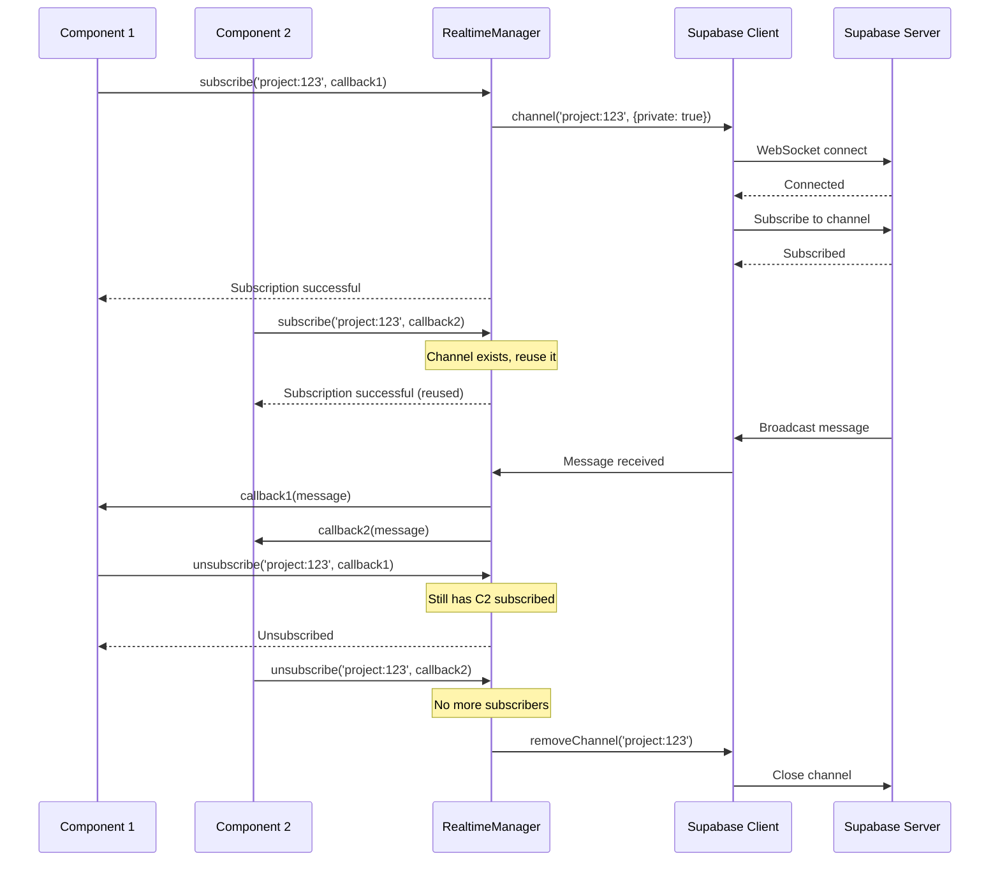
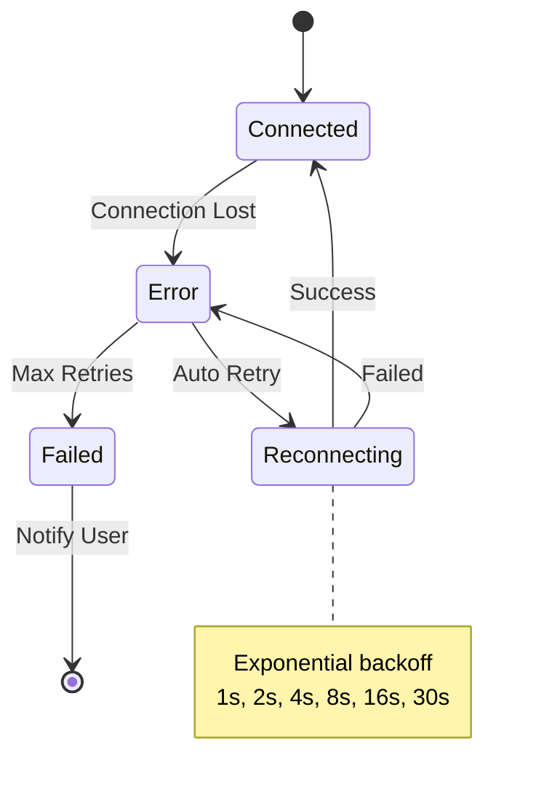

# Design Document

## Overview

Este design resolve o problema de múltiplas conexões WebSocket e timeouts no Supabase Realtime através de um gerenciador centralizado de conexões. A solução implementa o padrão singleton para o cliente Supabase e um sistema de registro de canais que permite compartilhamento entre componentes.

### Objetivos Principais

1. **Uma única conexão WebSocket** - Eliminar múltiplas tentativas de conexão
2. **Compartilhamento de canais** - Reutilizar canais para o mesmo tópico
3. **Sincronização fluida** - Updates em tempo real sem flickering
4. **Cleanup adequado** - Liberar recursos quando não são mais necessários
5. **Experiência responsiva** - Manter o canvas fluido durante operações realtime

## Architecture

### High-Level Architecture

```
┌─────────────────────────────────────────────────────────────┐
│                     Application Layer                        │
│  ┌──────────────┐  ┌──────────────┐  ┌──────────────┐      │
│  │  Component A │  │  Component B │  │  Component C │      │
│  └──────┬───────┘  └──────┬───────┘  └──────┬───────┘      │
│         │                  │                  │              │
│         └──────────────────┼──────────────────┘              │
│                            │                                 │
└────────────────────────────┼─────────────────────────────────┘
                             │
┌────────────────────────────┼─────────────────────────────────┐
│                  Realtime Manager Layer                      │
│                            │                                 │
│  ┌─────────────────────────▼──────────────────────────────┐ │
│  │         RealtimeConnectionManager (Singleton)          │ │
│  │                                                         │ │
│  │  - Supabase Client Instance                           │ │
│  │  - Channel Registry (Map<topic, ChannelWrapper>)      │ │
│  │  - Subscriber Registry (Map<topic, Set<callback>>)    │ │
│  └─────────────────────────┬──────────────────────────────┘ │
│                            │                                 │
└────────────────────────────┼─────────────────────────────────┘
                             │
┌────────────────────────────┼─────────────────────────────────┐
│                   Supabase Layer                             │
│                            │                                 │
│  ┌─────────────────────────▼──────────────────────────────┐ │
│  │              Single WebSocket Connection                │ │
│  │                                                         │ │
│  │  Channel: project:123  ──┐                            │ │
│  │  Channel: fal_jobs:456 ──┼─► Supabase Realtime        │ │
│  │  Channel: room:789     ──┘                            │ │
│  └─────────────────────────────────────────────────────────┘ │
└─────────────────────────────────────────────────────────────┘
```

### Component Interaction Flow



## Components and Interfaces

### 1. RealtimeConnectionManager

Gerenciador singleton que controla todas as conexões realtime.

```typescript
interface RealtimeConnectionManager {
  // Singleton instance
  getInstance(): RealtimeConnectionManager;
  
  // Channel management
  subscribe<T>(
    topic: string,
    event: string,
    callback: (payload: T) => void,
    options?: ChannelOptions
  ): SubscriptionHandle;
  
  unsubscribe(handle: SubscriptionHandle): void;
  
  // Broadcasting
  broadcast(
    topic: string,
    event: string,
    payload: unknown
  ): Promise<void>;
  
  // Connection state
  getConnectionState(): ConnectionState;
  
  // Cleanup
  cleanup(): void;
}

interface ChannelOptions {
  private?: boolean;
  self?: boolean;
  ack?: boolean;
}

interface SubscriptionHandle {
  topic: string;
  event: string;
  id: string;
}

type ConnectionState = 
  | 'disconnected'
  | 'connecting'
  | 'connected'
  | 'reconnecting'
  | 'error';
```

### 2. ChannelWrapper

Wrapper interno que gerencia um canal e seus subscribers.

```typescript
interface ChannelWrapper {
  topic: string;
  channel: RealtimeChannel;
  subscribers: Map<string, SubscriberInfo>;
  state: ChannelState;
  
  addSubscriber(
    event: string,
    callback: Function,
    id: string
  ): void;
  
  removeSubscriber(id: string): boolean;
  
  hasSubscribers(): boolean;
  
  getSubscriberCount(): number;
  
  close(): Promise<void>;
}

interface SubscriberInfo {
  id: string;
  event: string;
  callback: Function;
  addedAt: number;
}

type ChannelState = 
  | 'idle'
  | 'subscribing'
  | 'subscribed'
  | 'error'
  | 'closed';
```

### 3. useRealtimeSubscription Hook

Hook React simplificado que usa o RealtimeConnectionManager.

```typescript
interface UseRealtimeSubscriptionOptions<T> {
  topic: string;
  event: string;
  onMessage: (payload: T) => void;
  enabled?: boolean;
  private?: boolean;
}

interface UseRealtimeSubscriptionReturn {
  isConnected: boolean;
  isSubscribed: boolean;
  error: Error | null;
  broadcast: (event: string, payload: unknown) => Promise<void>;
}

function useRealtimeSubscription<T>(
  options: UseRealtimeSubscriptionOptions<T>
): UseRealtimeSubscriptionReturn;
```

### 4. Refactored Hooks

#### useProjectRealtime (Simplified)

```typescript
interface UseProjectRealtimeOptions {
  projectId: string;
  enabled?: boolean;
}

interface UseProjectRealtimeReturn {
  isConnected: boolean;
  error: Error | null;
}

function useProjectRealtime(
  options: UseProjectRealtimeOptions
): UseProjectRealtimeReturn {
  const { isConnected, error } = useRealtimeSubscription({
    topic: `project:${options.projectId}`,
    event: 'UPDATE',
    onMessage: (payload) => {
      // Trigger SWR revalidation
      mutate(`/api/projects/${options.projectId}`);
    },
    enabled: options.enabled,
    private: true,
  });
  
  return { isConnected, error };
}
```

#### useQueueMonitor (Simplified)

```typescript
function useQueueMonitor(options: UseQueueMonitorOptions) {
  const [jobs, setJobs] = useState<FalJob[]>([]);
  
  const { isConnected } = useRealtimeSubscription({
    topic: `fal_jobs:${options.userId}`,
    event: '*', // Listen to all events
    onMessage: (payload: JobUpdatePayload) => {
      handleJobUpdate(payload);
    },
    enabled: options.enabled,
    private: true,
  });
  
  // ... rest of the logic
}
```

## Data Models

### Channel Registry

```typescript
// Internal state in RealtimeConnectionManager
class RealtimeConnectionManager {
  private static instance: RealtimeConnectionManager;
  private supabaseClient: SupabaseClient;
  private channels: Map<string, ChannelWrapper>;
  private connectionState: ConnectionState;
  
  private constructor() {
    this.supabaseClient = createClient();
    this.channels = new Map();
    this.connectionState = 'disconnected';
  }
}
```

### Subscription Tracking

```typescript
interface SubscriptionMetrics {
  totalSubscriptions: number;
  activeChannels: number;
  subscriptionsByTopic: Map<string, number>;
  connectionUptime: number;
  lastError: Error | null;
}
```

## Error Handling

### Error Types

```typescript
enum RealtimeErrorType {
  CONNECTION_FAILED = 'CONNECTION_FAILED',
  SUBSCRIPTION_FAILED = 'SUBSCRIPTION_FAILED',
  CHANNEL_ERROR = 'CHANNEL_ERROR',
  TIMEOUT = 'TIMEOUT',
  AUTHENTICATION_FAILED = 'AUTHENTICATION_FAILED',
  NETWORK_ERROR = 'NETWORK_ERROR',
}

class RealtimeError extends Error {
  type: RealtimeErrorType;
  context: Record<string, unknown>;
  retryable: boolean;
  
  constructor(
    type: RealtimeErrorType,
    message: string,
    context?: Record<string, unknown>,
    retryable = true
  ) {
    super(message);
    this.type = type;
    this.context = context || {};
    this.retryable = retryable;
  }
}
```

### Retry Strategy

```typescript
interface RetryConfig {
  maxRetries: number;
  baseDelay: number;
  maxDelay: number;
  backoffMultiplier: number;
}

const DEFAULT_RETRY_CONFIG: RetryConfig = {
  maxRetries: 3,
  baseDelay: 1000,
  maxDelay: 30000,
  backoffMultiplier: 2,
};

function calculateRetryDelay(
  attempt: number,
  config: RetryConfig
): number {
  const delay = Math.min(
    config.baseDelay * Math.pow(config.backoffMultiplier, attempt),
    config.maxDelay
  );
  return delay;
}
```

### Error Recovery Flow



## Testing Strategy

### Unit Tests

1. **RealtimeConnectionManager Tests**
   - Singleton pattern enforcement
   - Channel creation and reuse
   - Subscriber management
   - Cleanup behavior

2. **ChannelWrapper Tests**
   - Subscriber add/remove
   - State transitions
   - Message broadcasting

3. **Hook Tests**
   - Subscription lifecycle
   - Error handling
   - Cleanup on unmount

### Integration Tests

1. **Multi-Component Subscription**
   - Multiple components subscribing to same topic
   - Channel reuse verification
   - Message delivery to all subscribers

2. **Connection Recovery**
   - Simulate connection loss
   - Verify reconnection
   - Verify resubscription

3. **Performance Tests**
   - High-frequency updates
   - Multiple simultaneous subscriptions
   - Memory leak detection

## Performance Optimizations

### 1. Message Batching

```typescript
interface MessageBatcher {
  batch(message: BroadcastMessage): void;
  flush(): void;
}

class MessageBatcher {
  private queue: BroadcastMessage[] = [];
  private flushTimer: NodeJS.Timeout | null = null;
  private readonly batchDelay = 16; // ~60fps
  
  batch(message: BroadcastMessage): void {
    this.queue.push(message);
    
    if (!this.flushTimer) {
      this.flushTimer = setTimeout(() => {
        this.flush();
      }, this.batchDelay);
    }
  }
  
  flush(): void {
    if (this.queue.length === 0) return;
    
    // Process all queued messages
    const messages = [...this.queue];
    this.queue = [];
    this.flushTimer = null;
    
    // Merge and apply updates
    this.applyBatchedUpdates(messages);
  }
}
```

### 2. Debounced Updates

```typescript
function useDebouncedRealtimeUpdate<T>(
  callback: (payload: T) => void,
  delay: number = 100
): (payload: T) => void {
  const timeoutRef = useRef<NodeJS.Timeout>();
  const latestPayloadRef = useRef<T>();
  
  return useCallback((payload: T) => {
    latestPayloadRef.current = payload;
    
    if (timeoutRef.current) {
      clearTimeout(timeoutRef.current);
    }
    
    timeoutRef.current = setTimeout(() => {
      if (latestPayloadRef.current) {
        callback(latestPayloadRef.current);
      }
    }, delay);
  }, [callback, delay]);
}
```

### 3. Optimistic Updates

```typescript
interface OptimisticUpdate<T> {
  id: string;
  data: T;
  timestamp: number;
  confirmed: boolean;
}

class OptimisticUpdateManager<T> {
  private updates: Map<string, OptimisticUpdate<T>> = new Map();
  
  add(id: string, data: T): void {
    this.updates.set(id, {
      id,
      data,
      timestamp: Date.now(),
      confirmed: false,
    });
  }
  
  confirm(id: string): void {
    const update = this.updates.get(id);
    if (update) {
      update.confirmed = true;
    }
  }
  
  rollback(id: string): T | undefined {
    const update = this.updates.get(id);
    this.updates.delete(id);
    return update?.data;
  }
  
  cleanup(maxAge: number = 30000): void {
    const now = Date.now();
    for (const [id, update] of this.updates) {
      if (update.confirmed || now - update.timestamp > maxAge) {
        this.updates.delete(id);
      }
    }
  }
}
```

## Multi-Window Synchronization

### Broadcast Channel API

Para sincronização entre janelas/tabs do mesmo navegador:

```typescript
class CrossTabSync {
  private bc: BroadcastChannel;
  
  constructor(channelName: string) {
    this.bc = new BroadcastChannel(channelName);
    this.setupListeners();
  }
  
  private setupListeners(): void {
    this.bc.onmessage = (event) => {
      const { type, payload } = event.data;
      
      switch (type) {
        case 'PROJECT_UPDATE':
          this.handleProjectUpdate(payload);
          break;
        case 'CANVAS_CHANGE':
          this.handleCanvasChange(payload);
          break;
      }
    };
  }
  
  broadcast(type: string, payload: unknown): void {
    this.bc.postMessage({ type, payload });
  }
  
  close(): void {
    this.bc.close();
  }
}
```

### Conflict Resolution

```typescript
interface ConflictResolver<T> {
  resolve(local: T, remote: T): T;
}

class LastWriteWinsResolver<T extends { updatedAt: string }> 
  implements ConflictResolver<T> {
  
  resolve(local: T, remote: T): T {
    const localTime = new Date(local.updatedAt).getTime();
    const remoteTime = new Date(remote.updatedAt).getTime();
    
    return remoteTime > localTime ? remote : local;
  }
}
```

## Migration Strategy

### Phase 1: Create New Infrastructure
- Implement RealtimeConnectionManager
- Create useRealtimeSubscription hook
- Add comprehensive logging

### Phase 2: Migrate Existing Hooks
- Refactor useProjectRealtime to use new manager
- Refactor useQueueMonitor to use new manager
- Keep old implementations as fallback

### Phase 3: Testing & Validation
- Test with multiple components
- Test multi-window scenarios
- Monitor for memory leaks

### Phase 4: Cleanup
- Remove old implementations
- Update documentation
- Remove fallback code

## Monitoring and Debugging

### Metrics to Track

```typescript
interface RealtimeMetrics {
  // Connection metrics
  connectionUptime: number;
  reconnectionCount: number;
  averageReconnectionTime: number;
  
  // Channel metrics
  activeChannels: number;
  totalSubscriptions: number;
  channelsByTopic: Map<string, number>;
  
  // Message metrics
  messagesReceived: number;
  messagesSent: number;
  averageLatency: number;
  
  // Error metrics
  errorCount: number;
  errorsByType: Map<RealtimeErrorType, number>;
}
```

### Debug Panel

```typescript
interface RealtimeDebugInfo {
  connectionState: ConnectionState;
  channels: Array<{
    topic: string;
    state: ChannelState;
    subscriberCount: number;
    lastMessage: number;
  }>;
  metrics: RealtimeMetrics;
  recentErrors: RealtimeError[];
}

function useRealtimeDebug(): RealtimeDebugInfo {
  const manager = RealtimeConnectionManager.getInstance();
  return manager.getDebugInfo();
}
```

## Security Considerations

### RLS Policies

Manter as políticas RLS existentes:

```sql
-- Already implemented in previous migrations
-- realtime.messages policies for private channels
```

### Authentication

```typescript
// Ensure auth token is set before subscribing
async function ensureAuthenticated(
  supabase: SupabaseClient
): Promise<void> {
  const { data: { session } } = await supabase.auth.getSession();
  
  if (!session) {
    throw new RealtimeError(
      RealtimeErrorType.AUTHENTICATION_FAILED,
      'No active session found',
      {},
      false // not retryable
    );
  }
  
  // Set auth for realtime
  supabase.realtime.setAuth(session.access_token);
}
```

## Design Decisions

### Why Singleton Pattern?

- **Single WebSocket Connection**: Prevents multiple connections to Supabase
- **Resource Efficiency**: Reduces memory and network overhead
- **Centralized State**: Easier to debug and monitor
- **Consistent Behavior**: All components use the same connection

### Why Channel Registry?

- **Reusability**: Multiple components can share the same channel
- **Reference Counting**: Automatically cleanup when no subscribers
- **Type Safety**: Strongly typed channel management
- **Performance**: Avoid creating duplicate channels

### Why Custom Hooks?

- **Simplicity**: Hide complexity from components
- **Consistency**: Standardized API across the app
- **Testing**: Easier to mock and test
- **Flexibility**: Can add features without changing components

## Future Enhancements

1. **Presence Tracking**: Add user presence for collaborative editing
2. **Cursor Sharing**: Show other users' cursors on canvas
3. **Conflict Resolution**: More sophisticated merge strategies
4. **Offline Support**: Queue messages when offline
5. **Performance Monitoring**: Real-time performance dashboard
