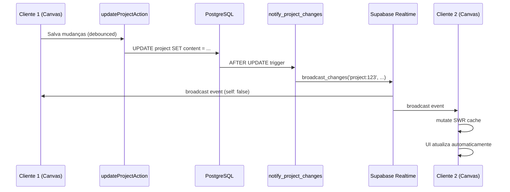

# Design Document

## Overview

Este documento descreve o design técnico para melhorar o sistema de realtime do Supabase no projeto, garantindo sincronização eficiente de projetos entre múltiplos clientes. O design segue as melhores práticas do Supabase Realtime, utilizando `broadcast` com triggers de banco de dados, canais privados, e gerenciamento adequado de estado.

### Objetivos

1. Corrigir o hook `useProjectRealtime` para funcionar sem causar re-renders desnecessários
2. Habilitar sincronização em tempo real de projetos entre múltiplos clientes
3. Implementar autenticação adequada antes de subscrever aos canais
4. Otimizar a revalidação de cache SWR para evitar problemas de performance
5. Garantir que as políticas RLS e triggers estejam corretos e otimizados

## Architecture

### Fluxo de Dados



### Componentes Principais

1. **useProjectRealtime Hook**: Gerencia subscrição ao canal de realtime
2. **ProjectProvider**: Fornece contexto do projeto e habilita realtime
3. **Canvas Component**: Salva mudanças com debounce
4. **Database Trigger**: Envia broadcasts quando projeto é atualizado
5. **RLS Policies**: Controla acesso aos canais privados

## Components and Interfaces

### 1. Hook useProjectRealtime (Corrigido)

**Localização**: `hooks/use-project-realtime.ts`

**Responsabilidades**:
- Subscrever ao canal `project:{projectId}` com configuração privada
- Autenticar antes de subscrever usando `setAuth()`
- Verificar estado do canal corretamente usando `CHANNEL_STATES`
- Revalidar cache SWR quando receber broadcasts
- Limpar subscrição adequadamente no cleanup

**Interface**:
```typescript
interface UseProjectRealtimeOptions {
  projectId: string | undefined;
  enabled?: boolean; // Permite desabilitar temporariamente
}

function useProjectRealtime(
  projectId: string | undefined,
  options?: UseProjectRealtimeOptions
): void;
```

**Configuração do Canal**:
```typescript
const channel = supabase.channel(`project:${projectId}`, {
  config: {
    broadcast: { 
      self: false,  // Não receber próprios broadcasts
      ack: true     // Confirmar recebimento
    },
    private: true   // Requer autenticação e RLS
  }
})
```

**Decisões de Design**:
- `self: false`: Evita processar broadcasts do próprio cliente, reduzindo re-renders
- `private: true`: Garante segurança através de RLS policies
- `ack: true`: Confirma que servidor recebeu a mensagem
- Usar `CHANNEL_STATES.SUBSCRIBED` ao invés de string literal
- Chamar `setAuth()` antes de `subscribe()` para garantir autenticação

### 2. ProjectProvider (Atualizado)

**Localização**: `providers/project.tsx`

**Responsabilidades**:
- Fornecer contexto do projeto para componentes filhos
- Habilitar hook `useProjectRealtime` com ID do projeto
- Gerenciar estado do projeto sem causar re-renders excessivos

**Mudanças**:
```typescript
export const ProjectProvider = ({
  children,
  data,
}: {
  children: ReactNode;
  data: typeof projects.$inferSelect;
}) => {
  // Habilitar realtime (remover comentário)
  useProjectRealtime(data.id);

  return (
    <ProjectContext.Provider value={{ project: data }}>
      {children}
    </ProjectContext.Provider>
  );
};
```

**Decisões de Design**:
- Manter contexto simples e imutável
- Deixar SWR gerenciar revalidação de dados
- Não armazenar estado mutável no contexto para evitar re-renders

### 3. Canvas Component (Otimizado)

**Localização**: `components/canvas.tsx`

**Responsabilidades**:
- Salvar mudanças no projeto com debounce de 1 segundo
- Usar mutação otimista para atualizar UI imediatamente
- Evitar salvar durante processo de salvamento

**Otimizações**:
```typescript
const save = useDebouncedCallback(async () => {
  if (saveState.isSaving || !project?.userId || !project?.id) {
    return;
  }

  try {
    setSaveState((prev) => ({ ...prev, isSaving: true }));

    // Mutação otimista: atualizar cache antes de salvar
    const newContent = toObject();
    mutate(
      `/api/projects/${project.id}`,
      { ...project, content: newContent },
      { revalidate: false }
    );

    const response = await updateProjectAction(project.id, {
      content: newContent,
    });

    if ('error' in response) {
      throw new Error(response.error);
    }

    setSaveState((prev) => ({ ...prev, lastSaved: new Date() }));
  } catch (error) {
    handleError('Error saving project', error);
    // Reverter mutação otimista em caso de erro
    mutate(`/api/projects/${project.id}`);
  } finally {
    setSaveState((prev) => ({ ...prev, isSaving: false }));
  }
}, 1000);
```

**Decisões de Design**:
- Usar mutação otimista para melhorar UX
- Debounce de 1 segundo para reduzir chamadas ao banco
- Reverter mudanças se salvamento falhar
- Evitar salvar se já estiver salvando

### 4. Database Trigger (Validado)

**Localização**: `supabase/migrations/20241216000002_project_broadcast_trigger.sql`

**Status**: Já implementado corretamente ✅

**Função**:
```sql
CREATE OR REPLACE FUNCTION notify_project_changes()
RETURNS TRIGGER
SECURITY DEFINER
LANGUAGE plpgsql
AS $$
BEGIN
  PERFORM realtime.broadcast_changes(
    'project:' || COALESCE(NEW.id, OLD.id)::text,
    TG_OP,
    'project_updated',
    TG_TABLE_NAME,
    TG_TABLE_SCHEMA,
    NEW,
    OLD
  );
  RETURN COALESCE(NEW, OLD);
END;
$$;
```

**Validação**:
- ✅ Usa `realtime.broadcast_changes` (recomendado)
- ✅ Tópico segue padrão `scope:entity` → `project:{id}`
- ✅ Evento usa snake_case → `project_updated`
- ✅ Trigger configurado para INSERT, UPDATE, DELETE
- ✅ Função é SECURITY DEFINER

### 5. RLS Policies (Validadas)

**Localização**: `supabase/migrations/20241216000002_project_broadcast_trigger.sql`

**Status**: Já implementado corretamente ✅

**Policy para realtime.messages**:
```sql
CREATE POLICY "users_can_receive_project_broadcasts" 
ON realtime.messages
FOR SELECT 
TO authenticated
USING (
  topic LIKE 'project:%' AND
  EXISTS (
    SELECT 1 FROM project
    WHERE id::text = SPLIT_PART(topic, ':', 2)
    AND (user_id = auth.uid()::text OR auth.uid()::text = ANY(members))
  )
);
```

**Índice para Performance**:
```sql
CREATE INDEX IF NOT EXISTS idx_project_user_members 
ON project(user_id, members);
```

**Validação**:
- ✅ Policy permite apenas usuários autenticados
- ✅ Verifica ownership ou membership do projeto
- ✅ Índice criado para otimizar query
- ✅ Usa SPLIT_PART para extrair ID do tópico

## Data Models

### Project Schema (Existente)

```typescript
export const projects = pgTable('project', {
  id: text('id').primaryKey().default(uuid).notNull(),
  name: varchar('name').notNull(),
  transcriptionModel: varchar('transcription_model').notNull(),
  visionModel: varchar('vision_model').notNull(),
  createdAt: timestamp('created_at').defaultNow().notNull(),
  updatedAt: timestamp('updated_at'),
  content: json('content'),           // Nodes e edges do canvas
  userId: varchar('user_id').notNull(),
  image: varchar('image'),
  members: text('members').array(),   // IDs de membros colaboradores
});
```

**Campos Relevantes para Realtime**:
- `id`: Usado no tópico do canal (`project:{id}`)
- `content`: Dados sincronizados em tempo real
- `userId`: Owner do projeto (usado em RLS)
- `members`: Colaboradores com acesso (usado em RLS)
- `updatedAt`: Timestamp da última atualização

### Broadcast Payload

**Estrutura do Payload Recebido**:
```typescript
interface BroadcastPayload {
  type: 'broadcast';
  event: 'project_updated';
  payload: {
    schema: 'public';
    table: 'project';
    commit_timestamp: string;
    eventType: 'INSERT' | 'UPDATE' | 'DELETE';
    new: Project | null;  // Novo estado (null em DELETE)
    old: Project | null;  // Estado anterior (null em INSERT)
    errors: null;
  };
}
```

**Uso no Cliente**:
```typescript
.on('broadcast', { event: 'project_updated' }, (payload) => {
  console.log('Project updated:', payload);
  
  // Revalidar cache SWR
  mutate(`/api/projects/${projectId}`);
})
```

## Error Handling

### 1. Erros de Subscrição

**Cenários**:
- Usuário não autenticado
- Falha na conexão WebSocket
- Timeout na subscrição
- Erro de autorização RLS

**Tratamento**:
```typescript
.subscribe((status, err) => {
  switch (status) {
    case 'SUBSCRIBED':
      console.log('✅ Realtime connected');
      break;
      
    case 'CHANNEL_ERROR':
      console.error('❌ Channel error:', err);
      // Cliente reconecta automaticamente
      break;
      
    case 'TIMED_OUT':
      console.error('⏱️ Subscription timed out');
      // Cliente reconecta automaticamente
      break;
      
    case 'CLOSED':
      console.log('🔌 Channel closed');
      break;
  }
})
```

### 2. Erros de Revalidação

**Cenários**:
- Falha ao buscar dados atualizados
- Dados corrompidos no cache
- Erro de rede

**Tratamento**:
```typescript
try {
  mutate(`/api/projects/${projectId}`);
} catch (error) {
  console.error('Error revalidating project:', error);
  // SWR tentará novamente automaticamente
}
```

### 3. Reconexão Automática

**Comportamento Built-in**:
- Cliente Supabase reconecta automaticamente
- Usa backoff exponencial
- Resubscreve aos canais após reconexão

**Configuração Opcional**:
```typescript
const supabase = createClient(url, key, {
  realtime: {
    params: {
      reconnectAfterMs: 1000  // Customizar timing
    }
  }
})
```

## Testing Strategy

### 1. Testes Unitários

**Hook useProjectRealtime**:
- ✅ Verifica que canal é criado com configuração correta
- ✅ Verifica que `setAuth()` é chamado antes de `subscribe()`
- ✅ Verifica que cleanup remove canal corretamente
- ✅ Verifica que não cria múltiplas subscrições

**Canvas Component**:
- ✅ Verifica que debounce funciona corretamente
- ✅ Verifica que mutação otimista atualiza cache
- ✅ Verifica que reverte em caso de erro

### 2. Testes de Integração

**Fluxo Completo**:
1. Cliente 1 faz mudança no canvas
2. Mudança é salva no banco com debounce
3. Trigger envia broadcast
4. Cliente 2 recebe broadcast
5. Cliente 2 revalida cache
6. UI do Cliente 2 atualiza

**Cenários de Teste**:
- ✅ Múltiplos clientes conectados ao mesmo projeto
- ✅ Cliente desconecta e reconecta
- ✅ Mudanças simultâneas (last-write-wins)
- ✅ Usuário sem permissão tenta subscrever

### 3. Testes de Performance

**Métricas**:
- Latência do broadcast (< 100ms ideal)
- Número de re-renders no Canvas
- Uso de memória com múltiplas subscrições
- Throughput de atualizações por segundo

**Ferramentas**:
- React DevTools Profiler
- Chrome Performance Tab
- Supabase Dashboard (Realtime Inspector)

### 4. Testes de Segurança

**Validações**:
- ✅ Usuário não autenticado não consegue subscrever
- ✅ Usuário sem permissão não recebe broadcasts
- ✅ RLS policies bloqueiam acesso não autorizado
- ✅ Índices estão presentes para performance

## Performance Considerations

### 1. Otimizações Implementadas

**Canal Dedicado por Projeto**:
- ✅ Usa `project:{id}` ao invés de canal global
- ✅ Reduz tráfego de rede
- ✅ Melhora escalabilidade

**Debounce de Salvamento**:
- ✅ 1 segundo de debounce reduz writes no banco
- ✅ Agrupa múltiplas mudanças em uma única operação

**Mutação Otimista**:
- ✅ UI atualiza imediatamente
- ✅ Melhora percepção de performance

**self: false**:
- ✅ Cliente não processa próprios broadcasts
- ✅ Reduz re-renders desnecessários

### 2. Índices de Banco de Dados

**Índice Existente**:
```sql
CREATE INDEX IF NOT EXISTS idx_project_user_members 
ON project(user_id, members);
```

**Benefícios**:
- Acelera verificação de RLS policies
- Melhora performance de queries em `realtime.messages`
- Essencial para escalabilidade

### 3. Limites e Escalabilidade

**Limites do Supabase Realtime**:
- Máximo de 100 conexões simultâneas por canal (Free tier)
- Máximo de 500 mensagens por segundo por canal
- Tamanho máximo de payload: 250KB

**Estratégias de Escala**:
- Usar canais dedicados por projeto (já implementado)
- Considerar sharding se projeto tiver > 100 colaboradores
- Monitorar uso no Supabase Dashboard

## Migration Path

### Fase 1: Correções Imediatas ✅

1. Corrigir verificação de estado do canal
2. Adicionar `setAuth()` antes de subscrever
3. Habilitar hook no ProjectProvider

### Fase 2: Otimizações 🔄

1. Implementar mutação otimista no Canvas
2. Adicionar logging estruturado
3. Configurar log_level baseado em ambiente

### Fase 3: Monitoramento 📊

1. Adicionar métricas de performance
2. Monitorar latência de broadcasts
3. Alertas para erros de conexão

## Security Considerations

### 1. Autenticação

**Implementação**:
- ✅ Canais privados requerem autenticação
- ✅ `setAuth()` chamado antes de subscrever
- ✅ Token JWT validado pelo Supabase

### 2. Autorização

**RLS Policies**:
- ✅ Apenas owner e members podem acessar projeto
- ✅ Policy em `realtime.messages` controla acesso ao canal
- ✅ Índices garantem performance das verificações

### 3. Validação de Dados

**Server-side**:
- ✅ `updateProjectAction` valida ownership
- ✅ Drizzle ORM previne SQL injection
- ✅ Trigger usa SECURITY DEFINER

**Client-side**:
- Validar estrutura do payload recebido
- Sanitizar dados antes de renderizar
- Tratar erros de parsing graciosamente

## Monitoring and Debugging

### 1. Logging

**Desenvolvimento**:
```typescript
const supabase = createClient(url, key, {
  realtime: {
    params: { log_level: 'info' }
  }
})
```

**Produção**:
```typescript
const supabase = createClient(url, key, {
  realtime: {
    params: { log_level: 'error' }
  }
})
```

### 2. Métricas

**Supabase Dashboard**:
- Realtime Inspector: Ver mensagens em tempo real
- Connection count: Número de conexões ativas
- Message rate: Taxa de mensagens por segundo

**Custom Metrics**:
- Latência de salvamento
- Taxa de re-renders
- Erros de subscrição

### 3. Debugging

**Console Logs**:
- 🔴 Prefixo para logs de realtime
- Status de subscrição
- Payloads recebidos
- Erros de revalidação

**React DevTools**:
- Profiler para detectar re-renders
- Components tree para verificar contexto
- Hooks para inspecionar estado

## Conclusion

Este design implementa um sistema robusto de realtime para sincronização de projetos, seguindo todas as melhores práticas do Supabase Realtime:

✅ Usa `broadcast` com triggers de banco de dados
✅ Canais privados com RLS policies
✅ Autenticação adequada com `setAuth()`
✅ Gerenciamento correto de estado do canal
✅ Cleanup apropriado de subscrições
✅ Otimizações de performance (debounce, mutação otimista)
✅ Índices de banco de dados para escalabilidade
✅ Tratamento de erros e reconexão automática
✅ Logging e monitoramento estruturados

O sistema está pronto para suportar colaboração em tempo real entre múltiplos usuários de forma eficiente e segura.
