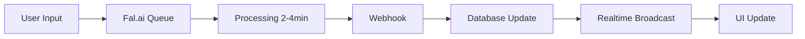

# WAN-25 Preview Model - Complete Documentation

## 📚 Índice de Documentação

Este é o índice principal para toda a documentação do modelo WAN-25 Preview.

### 📖 Documentos Disponíveis

1. **[WAN_25_SUMMARY.md](./WAN_25_SUMMARY.md)** - Resumo Executivo
   - Status da implementação
   - Características principais
   - Comparação com outros modelos

2. **[WAN_25_QUICK_START.md](./WAN_25_QUICK_START.md)** - Guia Rápido
   - Como usar na interface
   - Fluxo de processamento
   - Troubleshooting básico

3. **[WAN_25_MODEL_IMPLEMENTATION.md](./WAN_25_MODEL_IMPLEMENTATION.md)** - Documentação Técnica
   - Detalhes de implementação
   - Arquivos modificados
   - Configuração técnica

4. **[WAN_25_EXAMPLES.md](./WAN_25_EXAMPLES.md)** - Exemplos de Prompts
   - Prompts por categoria
   - Boas práticas
   - Dicas avançadas

5. **[WAN_25_DEPLOYMENT_CHECKLIST.md](./WAN_25_DEPLOYMENT_CHECKLIST.md)** - Checklist de Deploy
   - Passos de deployment
   - Testes necessários
   - Troubleshooting

6. **[test-wan-25-model.js](./test-wan-25-model.js)** - Script de Teste
   - Validação automática
   - Testes de configuração

## 🚀 Quick Start

### Instalação

O modelo já está implementado! Basta:

```bash
# 1. Verificar variáveis de ambiente
echo "FAL_API_KEY: ${FAL_API_KEY:+✅}"
echo "NEXT_PUBLIC_APP_URL: ${NEXT_PUBLIC_APP_URL:+✅}"

# 2. Executar teste
node test-wan-25-model.js

# 3. Iniciar servidor
npm run dev
```

### Uso Básico

1. Abra um projeto
2. Adicione um nó de vídeo
3. Selecione "WAN-25 Preview (Text-to-Video)"
4. Digite seu prompt
5. Clique em "Generate"

## 📊 Visão Geral

### Características

| Característica | Valor |
|----------------|-------|
| **Tipo** | Text-to-Video |
| **Imagem** | ❌ Não requerida |
| **Durações** | 5s, 10s |
| **Aspect Ratios** | 16:9, 9:16, 1:1 |
| **Webhook** | ✅ Sim |
| **Realtime** | ✅ Sim |
| **Status** | ✅ Enabled |

### Preços Estimados

- **5s**: ~$0.50
- **10s**: ~$1.00

### Tempo de Processamento

- **5s**: ~2-3 minutos
- **10s**: ~3-4 minutos

## 🎯 Casos de Uso

### ✅ Ideal Para

- Geração de vídeo a partir de texto
- Prototipagem rápida
- Criação sem assets de imagem
- Testes de conceitos visuais

### ❌ Não Recomendado Para

- Image-to-video (use Kling ou Sora 2)
- Vídeos longos (> 10s)
- Aspect ratios customizados

## 📁 Estrutura de Arquivos

```
lib/models/video/
├── fal.ts                 # Tipos (client)
├── fal.server.ts          # Tipos (server)
├── index.ts               # Modelos (client)
└── index.server.ts        # Modelos (server)

docs/
├── WAN_25_README.md                    # Este arquivo
├── WAN_25_SUMMARY.md                   # Resumo
├── WAN_25_QUICK_START.md               # Guia rápido
├── WAN_25_MODEL_IMPLEMENTATION.md      # Técnico
├── WAN_25_EXAMPLES.md                  # Exemplos
├── WAN_25_DEPLOYMENT_CHECKLIST.md      # Deploy
└── test-wan-25-model.js                # Teste
```

## 🔄 Fluxo de Processamento



## 🧪 Testes

### Executar Teste Automático

```bash
node test-wan-25-model.js
```

### Resultado Esperado

```
✅ Test 1: Model Registration
✅ Test 2: Model Configuration
✅ Test 3: Model Availability
✅ Test 4: Model Type Validation
✅ Test 5: Duration Compatibility
✅ Test 6: Aspect Ratio Compatibility

🎉 All tests passed!
```

## 📖 Exemplos de Prompts

### Simples

```
A serene sunset over the ocean with gentle waves
```

### Detalhado

```
Aerial view of a modern city at night with lights turning on,
traffic flowing through streets, cinematic drone shot, 4K quality
```

### Artístico

```
Colorful ink drops spreading in water, slow motion,
vibrant colors mixing and swirling, high-speed photography
```

**Mais exemplos**: Ver [WAN_25_EXAMPLES.md](./WAN_25_EXAMPLES.md)

## 🐛 Troubleshooting

### Modelo não aparece

```bash
# Limpar cache e rebuild
rm -rf .next
npm run build
npm run dev
```

### Erro ao gerar

```bash
# Verificar variáveis
echo $FAL_API_KEY
echo $NEXT_PUBLIC_APP_URL
```

### Não atualiza automaticamente

```bash
# Aplicar migração de broadcast
supabase db push
```

**Mais soluções**: Ver [WAN_25_DEPLOYMENT_CHECKLIST.md](./WAN_25_DEPLOYMENT_CHECKLIST.md)

## 🔗 Links Úteis

- [Fal.ai WAN-25 Model](https://fal.ai/models/wan-25-preview)
- [Fal.ai API Documentation](https://fal.ai/docs)
- [Supabase Realtime Docs](https://supabase.com/docs/guides/realtime)

## 📞 Suporte

### Documentação

1. Leia o [Quick Start](./WAN_25_QUICK_START.md)
2. Consulte os [Exemplos](./WAN_25_EXAMPLES.md)
3. Verifique o [Checklist de Deploy](./WAN_25_DEPLOYMENT_CHECKLIST.md)

### Problemas Técnicos

1. Execute o teste: `node test-wan-25-model.js`
2. Verifique os logs do servidor
3. Consulte a [Documentação Técnica](./WAN_25_MODEL_IMPLEMENTATION.md)

## 📝 Changelog

### v1.0.0 (2024-12-16)

- ✅ Implementação inicial do modelo WAN-25
- ✅ Suporte a webhook e realtime
- ✅ Documentação completa
- ✅ Testes automatizados
- ✅ Exemplos de prompts

## 🎯 Roadmap

### Próximas Versões

- [ ] Validar preços oficiais
- [ ] Adicionar exemplos na UI
- [ ] Otimizar prompts padrão
- [ ] Coletar métricas de uso
- [ ] Comparação de qualidade com outros modelos

## 👥 Contribuindo

### Melhorias Sugeridas

1. Adicionar mais exemplos de prompts
2. Documentar casos de uso específicos
3. Otimizar configurações padrão
4. Melhorar mensagens de erro

### Reportar Problemas

1. Descreva o problema
2. Inclua logs relevantes
3. Especifique configuração usada
4. Forneça passos para reproduzir

## 📄 Licença

Este modelo usa a API da Fal.ai. Consulte os [Termos de Serviço da Fal.ai](https://fal.ai/terms).

---

**Implementado por**: Kiro AI Assistant  
**Data**: 2024-12-16  
**Status**: ✅ Production Ready  
**Versão**: 1.0.0

---

## 🎉 Pronto para Usar!

O modelo WAN-25 Preview está completamente implementado e pronto para uso em produção.

**Comece agora**: Abra a aplicação e selecione "WAN-25 Preview (Text-to-Video)" no dropdown de modelos de vídeo!
